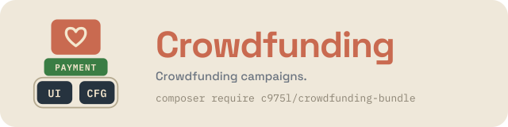

# CrowdfundingBundle

Symfony bundle for crowdfunding campaigns on the c975L core — counterparts, contributors, news and media, plus an optional lottery tied to a campaign. Checkout is delegated to [c975L/PaymentBundle](https://github.com/975L/PaymentBundle).

[](https://github.com/975L/CrowdfundingBundle/blob/master/LICENSE)
[](https://packagist.org/packages/c975l/crowdfunding-bundle)
[](https://packagist.org/packages/c975l/crowdfunding-bundle)
[](https://app.codacy.com/gh/975L/CrowdfundingBundle/dashboard)

> **BUNDLE UNDER DEVELOPMENT — USE AT YOUR OWN RISK**

---

## Why CrowdfundingBundle



Add CrowdfundingBundle on top of the shared [UiBundle](https://github.com/975L/UiBundle) + [ConfigBundle](https://github.com/975L/ConfigBundle) foundation to get crowdfunding campaigns and a tied-in lottery. Checkout flows through [PaymentBundle](https://github.com/975L/PaymentBundle)'s Basket/checkout engine (`BasketItemProviderInterface`) instead of duplicating one, and media uploads reuse UiBundle's own `VichMediaTrait`.

---

> **TL;DR** — Crowdfunding campaigns (counterparts, contributors, news, media) plus a lottery tied to a campaign. Checkout isn't here: contributions flow through PaymentBundle's Basket engine via `BasketItemProviderInterface`. Extracted from ShopBundle in its v2.0, with the same table names.

## Contents

- **Setup** — [requirements](#requirements) · [installation](#installation) · [assets](#install-assets) · [config values](#load-configuration-values) · [routes](#enable-routes)
- **Using it** — [sitemap](#sitemap) · [linking a campaign](#linking-a-campaign-from-a-menu) · [composing a campaign page](#composing-a-campaign-page) · [status report](#status-report) · [emails](#emails) · [backup](#backup) · [translations](#translations) · [what it does not contribute](#what-this-bundle-deliberately-does-not-contribute) · [AI agent skills](#ai-agent-skills) · [data compatibility with ShopBundle](#data-compatibility-with-existing-shopbundle-installations)

## Features

- Crowdfunding campaigns with counterparts, contributors, news, videos
- Lottery tied to a crowdfunding campaign (prizes, tickets, winner draw)
- Plugs into PaymentBundle's Basket/checkout engine via `BasketItemProviderInterface`
- EasyAdmin CRUD for crowdfunding, from which counterparts, medias, videos and the lottery are all edited
- A campaign hidden until it is opened, previewed from the back office, and deleted in two steps through a
  recycle bin — see [opening, previewing and deleting a campaign](#opening-previewing-and-deleting-a-campaign)
- Sitemap generation (index and campaign pages), via ConfigBundle's `SitemapProviderInterface`
- Its own `crowdfunding` translation catalogue, in English, French and Spanish
- Stylesheet and Stimulus barrel contributed to UiBundle's registries — nothing to register by hand
- Campaign pages composed in the back office with UiBundle's block kinds (`HasBlocksInterface`), plus
  three kinds of its own, and a fourth listing the campaigns on any page of the site — see
  [composing a campaign page](#composing-a-campaign-page)
- Three transactional emails composable in the back office, via UiBundle's `EmailTemplateProviderInterface`
- Campaign pages offered as menu targets (`LinkableRouteProviderInterface`) and media folders declared to the backup
- Pending lottery draws reported to the status dashboard (`StatusProviderInterface`)
- Every file a campaign declares checked against the disk, under its own `files-crowdfunding` health check kind
- **A skill for coding agents**, shipped in the package and read straight from `vendor/` — see [AI agent skills](#ai-agent-skills)

---

## Requirements

- PHP >= 8.4, Symfony 8
- [c975L/CoreBundle](https://github.com/975L/CoreBundle) — ConfigBundle and UiBundle in one package. It also
  provides `Entity\Trait\VichMediaTrait`, used by this bundle's own `Media` (the Doctrine `SINGLE_TABLE` base
  for crowdfunding and lottery uploads) — fully independent from ShopBundle's own media hierarchy, no
  dependency between the two
- [c975L/PaymentBundle](https://github.com/975L/PaymentBundle) — owns the Basket/checkout engine

ShopBundle is **not** a dependency: a site can run a campaign without a shop.

---

## Installation

### Download

```bash
composer require c975l/crowdfunding-bundle
```

### Install assets

```bash
php bin/console assets:install --symlink
```

This exposes the bundle's compiled stylesheet at `public/bundles/c975lcrowdfunding/css/styles.min.css` and the
smileys and calendar icons a campaign draws.

### Run migrations

```bash
php bin/console doctrine:migrations:diff
php bin/console doctrine:migrations:migrate
```

### Load configuration values

```bash
php bin/console c975l:config:load-all
```

Then open the ConfigBundle dashboard to set values for each key.

### Enable routes

Add to `config/routes.yaml`:

```yaml
c975_l_crowdfunding:
    resource: "@c975LCrowdfundingBundle/src/Controller/"
    type: attribute
```

### Nothing to register by hand

The bundle ships one Stimulus entrypoint, `assets/controllers.js`, which starts its own app and registers
its controllers **lazily**: the front layout loads the barrel site-wide, and the `lottery` controller is
only downloaded by a document actually carrying `data-controller="lottery"`. It is announced to UiBundle's
script registry by `Service\ScriptProvider`, so as long as your layout renders
`{{ importmap(['app']|merge(bundle_scripts())) }}` (see [c975L/UiBundle](https://github.com/975L/UiBundle)'s
`bundle_scripts()`) there is no `assets/bootstrap.js` to edit.

Its `importmap.php` entry is declared by `Management\ImportmapProvider` and written the first time you
`composer update` after installing the bundle:

```bash
php bin/console c975l:config:check-importmap
```

reports any entry that is missing.

The counterparts' add buttons are PaymentBundle's own `basket` controller, registered by that bundle's
barrel — nothing to do here for them.

---

## Sitemap

The urls are declared by `CrowdfundingSitemapProvider` (ConfigBundle's `SitemapProviderInterface`): the
`/crowdfunding` index plus one entry per campaign, a running one declared as changing daily and a finished
one as the archive page it has become. Lotteries are deliberately left out — their url is keyed by a
13-character identifier rather than a readable slug, and a drawn lottery is over. Nothing to register — the
provider is picked up automatically.

`public/sitemap-crowdfunding.xml` and the site's `public/sitemap-index.xml` are written by ConfigBundle,
which collects every installed bundle's provider:

```bash
php bin/console c975l:sitemaps:create
```

Those same urls are also **health-checked** for free, with `c975l/site-bundle` installed: every declared url
gets the content-quality checks (title/description length, missing `<h1>`, Open Graph share tags, images
without `alt`, broken links) under its own `urls-crowdfunding` kind on the Health check dashboard:

```bash
php bin/console c975l:health-check:run --kind=urls-crowdfunding
```

### A file the database declares and the server no longer has

`Management\CrowdfundingFilesHealthCheckProvider` (kind `files-crowdfunding`) reports, as an error, every file a row of this bundle names and the server no longer holds: a campaign's pictures and video, the picture of each counterpart, and a lottery's video. Everything it does is CoreBundle's `AbstractDeclaredFilesHealthCheckProvider`, this only names the rows to look at.

```bash
php bin/console c975l:health-check:run --kind=files-crowdfunding
```

A counterpart and a lottery have no back-office screen of their own — they are edited as collections of the campaign — so their rows link back to that campaign.

---

## Linking a campaign from a menu

This bundle owns no SiteBundle `Page`, so its pages are offered to a menu item through
`Management\LinkableRouteProvider`: the campaign index, and each campaign by its own title. Pick them in
the menu item's target select — nothing to register, the provider is picked up automatically.

## Composing a campaign page

A campaign page is not a fixed sequence any more. `crowdfunding/display.html.twig` renders the funding
and the campaign's own fields, then the blocks the editor composed, then the sections that are still
hardcoded — and **each of those steps aside as soon as a block takes it over**, the way a product sheet
does in `c975L/ShopBundle`:

```twig

...

    <twig:c975LCrowdfunding:Crowdfunding:CounterParts counterparts="{{ crowdfunding.counterparts }}"/>

```

A campaign carrying no block therefore still reads in full — the begin and end dates having moved up
into the funding bar, beside the amounts they run against — and one being recomposed moves a single
section at a time. Nothing has to be migrated.

### The shape of the page

The page is read in three movements. The funding is said once, by the rail: a strip stuck under the site's
header used to double it the whole way down, which said the same amounts and the same gauge twice on one
screen.

1. **`Crowdfunding:Hero`** — the campaign's opening image, its name printed over it. Stands aside for a
   composed `banner_title`, which is an editor saying where the opening goes; the layout's own heading is
   then left on, since only the editor knows what level their banner carries.
2. **The story and the funding**, side by side: one column on a phone, a 380px rail from 1024px up. The
   rail sticks under the site's header and holds the *Campaign* card, then the campaign's draws in full —
   what a contribution is weighed against, both in sight while the story is read.
3. **`Crowdfunding:UseFor` and `Crowdfunding:Author`** on one tinted band between the story and the tiers —
   the two answers a visitor weighs a tier against, read together rather than one at each end of the page.
   The tiers follow, then the chronicle, on two columns from 1024px up. A tier is a row, not a card:
   `<details name="counterparts">`, so only one opens at a time — HTML's own exclusive accordion, the same
   row ShopBundle gives a product's items, with the picture as the row's full-height left column and the
   price in a column of its own, on one line whatever a tier is named.

Where the campaign stands is worked out once, by `crowdfunding_funding_state()`
(`Twig\Extension\CrowdfundingFundingExtension`): whether it opened, whether it closed, how far it got and
how many days it still has. The rail and the tiers read that same answer, so neither of them
can say something the others contradict — and a tier carries a way to join only while the campaign can be
joined: closed or not yet open, the rail says it once for the whole page rather than every card saying it.

### What a media is for

A campaign holds one collection of images, and each carries the use it was uploaded under
(`CrowdfundingMedia::$kind`). The campaign's screen has a field per use, and the page reads each one where
it shows it:

| Kind | Field | Read by |
| --- | --- | --- |
| `hero` | *Opening image* | `Crowdfunding:Hero`, the catalogue's thumbnail, the `og:image` |
| `slide` | *Slider* | the page's slider and the `crowdfunding_slider` block |

The field a file is dropped on is what sets its kind (`Crowdfunding::addHero()`, `addSlide()`), so a site
never names any of them. **One file, one use**: nothing reads "the first media" any more, and a campaign
with no opening image opens without one rather than on whichever plate happened to be sorted first. The
same image wanted in both places is uploaded on both fields — two rows, moved and removed apart.

An editor reading the page hovers any of those sections and gets the same pencil a composed block carries:
`crowdfunding_edit_url()` (`Twig\Extension\CrowdfundingEditExtension`) writes a `data-block-edit-url` on
the section, which UiBundle's own overlay picks up, and the campaign's form opens on the very field the
section is written in — the opening image on `heroes`, the story on `description`, the use of the funds on
`useFor`, the author on `authorName`, the funding on `amountGoal`, the tiers on `counterparts`, the draws
on `lotteries`. Anyone but an editor gets no url, so nothing of it reaches the page a visitor reads.

### The three kinds of a campaign page

| Kind | Takes over | Form | Template |
| --- | --- | --- | --- |
| `crowdfunding_slider` | the campaign's slider | `Form\Block\SliderBlockType` | `blocks/Slider.html.twig` |
| `crowdfunding_counterparts` | `Crowdfunding:CounterParts` | `Form\Block\CounterpartsBlockType` | `blocks/Counterparts.html.twig` |
| `crowdfunding_lottery` | `Lottery:Lotteries` | `Form\Block\LotteryBlockType` | `blocks/Lottery.html.twig` |

None of them stores what to show — only how. The medias, the tiers, the draws and their prizes are read
from the campaign's own rows at render time, through `crowdfunding_block_campaign()`
(`Twig\Extension\CrowdfundingBlockExtension`), which resolves the campaign from the `crowdfunding_display`
or `crowdfunding_preview` route being rendered. So a block never goes stale against the funding, no form
ever asks which campaign to show, and one of these kinds placed on a page that is not a campaign renders
nothing at all.

`crowdfunding_slider` shows the campaign's medias and nothing else, so its render is cached under a
campaign tag dropped by `CrowdfundingCacheInvalidationListener` whenever a campaign or one of its
medias changes. A tier or a contribution drops nothing: no cached render is drawn from either, and a
kind reading them would have to join that listener along with its own resolver.

The two others are declared `cacheable: false` and **render live**, the same way ShopBundle's
`shop_search` is not cached — the answer belongs to the kind, not to one of its instances. A
block cache entry never expires and no event fires the day a campaign ends, so a cached grid of tiers
would keep offering to contribute to a campaign that closed — each tier's button being read against
today's date — and the basket messages laid beside them belong to whoever is reading. The draws have
the same trouble twice over: their dates are printed in the visitor's own timezone and the draw button
is an administrator's alone.

### The listing kind

`crowdfunding_campaigns` is the one kind of this bundle placed on an ordinary page rather than on a
campaign's own — the section a site opens its home page with, say. It lists the campaigns a visitor may
read, each on the card the `/crowdfunding` page already shows (`Crowdfunding:Crowdfunding`): the cover,
the dates, the gauge, the amount achieved against the goal and where the campaign stands.

| Kind | Shows | Form | Template |
| --- | --- | --- | --- |
| `crowdfunding_campaigns` | `Crowdfunding:Crowdfunding`, one card per campaign | `Form\Block\CampaignsBlockType` | `blocks/Campaigns.html.twig` |

Being a section of a page and not a slot of a campaign, it is the only kind carrying a head of its own —
anchor, eyebrow, title, paragraph, link and colored flat — so the section and its cards are one row in the
back office instead of a `text_section` that has to be moved, hidden and translated beside it. Its only
other field is a maximum, empty meaning every visible campaign.

The rows are read live through `crowdfunding_block_campaigns()`, which runs the very query the
`/crowdfunding` page runs (`CrowdfundingRepository::findAllSorted()`), so a campaign opened, closed or
reordered in the back office shows up without anyone touching the page, and the listing and that page
never name two different sets. It is declared `cacheable: false` for the reason the tiers are: each card
counts the days left against today, and no event fires the day a campaign starts or ends.

### The silhouette in the picker

`Service\CrowdfundingShowcaseProvider` draws the slider in UiBundle's block showcase, so the picker shows
what the kind looks like instead of its name alone. The counterparts and the lottery are deliberately
absent: both draw PaymentBundle's basket around a tier a visitor could click, and a showcase card
offering to contribute to a campaign that does not exist would be worse than no card.

The front-end "Edit this block" hover button resolves a campaign's own edit screen through
`Management\CrowdfundingBlockEditUrlProvider`, so a composed campaign page is corrected the way a site
page's blocks already are.

### The funding bar

`Crowdfunding:FundingBar` gathers the goal, the amount achieved, the gauge, the contributors, the days
left and the button to contribute. It is a **component the page renders**, not a kind: it stands outside
the flow the blocks are laid in — a sticky bar under the navbar on a phone, a 380px rail beside the story
from 1024px up — and a campaign whose editor forgot to place it would be a campaign nobody can fund.

Its button points at `#counterparts`, which both the `crowdfunding_counterparts` block and the hardcoded
section carry, so it lands wherever the tiers were put.

---

## Opening, previewing and deleting a campaign

A campaign is written before it is opened, and removed in two deliberate steps — the same three gestures
ShopBundle gives a product and SiteBundle gives a page.

**Hidden.** `Crowdfunding::$hidden` is a switch on the campaign's screen. A hidden campaign is out of the
listing, out of `sitemap-crowdfunding.xml`, out of the menu targets and out of the basket, and its page
answers 404 — it is not written anywhere that it exists. The column defaults to `false`, so campaigns
already online stay online; the property defaults to `true`, so a campaign created from now on starts
hidden and is opened once its page is composed.

**Preview.** `/crowdfunding/{slug}/preview` (route `crowdfunding_preview`, behind `site-role-editor`) serves
that very page, with two differences: a banner says it is a preview, and the render never touches the
block cache (`BlockRenderContext::disableCache()`), so what is read is what was just saved and nothing of
it is served to a visitor afterwards. The kinds of this bundle compose it as they compose the public page.

**Who administers a campaign.** The whole CRUD sits behind `site-role-editor`, as SiteBundle's pages do:
index, form, entity permission, QR code and the two buttons leading to the site. Only the recycle bin's own
two gestures are stricter, on `site-role-admin`, and so is the lottery's draw.

**What the form deletes.** The campaign's five collections carry `orphanRemoval`, so a media, a tier, a
video, a news or a draw taken off the form is removed rather than left behind with a null campaign. Two are
put back by `CrowdfundingCrudController::updateEntity()`, which says so in a message: a counterpart a
contributor already paid for, whose removal the contributors' own rows would have the database refuse, and a
draw a ticket was sold on, which refuses nothing on its own and would take its winner with it.

**Recycle bin.** Deleting a campaign from the back office writes `isDeleted` and nothing else — no row is
removed, no file is deleted, its medias, counterparts, news and draws all stay where they are. A trashed
campaign is hidden with it and its page answers **410**, which a search engine acts on far faster than a
404. The recycle bin is the index's own view (`?trash=1`), and it is the only place the two irreversible
gestures live:

| Action | What it does |
| --- | --- |
| *Restore* | writes `isDeleted = false`; the campaign comes back **hidden**, to be read once before it is opened again |
| *Delete permanently* | removes the campaign and everything cascading from it — its medias, its counterparts, its news, its draws, **and the contributions it received**, tickets included — and writes a `gone` Redirect at its url so the 410 outlives the row; the redirects that pointed at it become `gone` rows too, and a path an admin already redirected keeps its own target |

Both are `GET` actions guarded by a csrf token and by `site-role-admin`, and both refuse a campaign that is
not in the recycle bin.

## Status report

`Management\CrowdfundingStatusProvider` reports two numbers under the `crowdfunding` key of
`/status/report`: the prizes whose draw date has passed and which hold no winning ticket, and the date of
the oldest of them. A draw is a click nobody made, and every ticket holder is waiting on it.

Nothing else is reported on purpose: a count of campaigns or of contributors is read once, decides nothing
and buries what matters. A campaign's own progress belongs on its page, where its author reads it.

---

## Emails

Three emails, all composed in the back office rather than in a Twig file: the contribution's thank-you,
the lottery tickets a contribution earned, and the winning ticket. `Email\CrowdfundingEmailTemplateProvider`
declares them, `c975l:ui:email-templates:ensure` seeds the rows an admin then rewrites, and the renderer
falls back on the declaration itself if a row is ever deleted.

```bash
php bin/console c975l:ui:email-templates:ensure
```

What the code computes — the counterparts taken, the ticket numbers drawn, the prize won — stays in
`templates/emails/slots/`, which an app may override; the sentences around them belong to the admin.

Each goes out in the language its contribution was made in: `CrowdfundingContributor::$locale` is read off
the basket at payment, a lottery being drawn long after the contributor's own visit.

---

## Backup

`Management\CrowdfundingBackupPathProvider` declares `public/medias/crowdfunding` to ConfigBundle's backup,
mirrored rather than archived. Nothing to register — the provider is picked up automatically. The legacy
`medias/shop/crowdfundings|counterparts` folders of the ShopBundle era are deliberately **not** declared:
this bundle uploads nothing there any more.

---

## Translations

The bundle ships `translations/crowdfunding.{en,fr,es}.xlf` and resolves every label in its own
**`crowdfunding`** domain. Its wordings were read from ShopBundle's `shop` domain until 07/09/2026, which
left every page showing raw keys on a site running a campaign without the shop — see
[UPGRADE.md](UPGRADE.md) if you had overridden any of them.

The draw wheel's own wording is not in that catalogue: it is written by JavaScript after a fetch, where a
Twig `|trans` never reaches, so it lives in `assets/js/translations.js`, keyed by locale.

Nor does `trans_default_domain` reach what a template writes between the tags of a component: that content
is compiled as an embedded template of its own, so every key named inside a `<twig:…>…</twig:…>` spells its
domain out. Worth knowing before overriding one of the components, where a key left bare prints raw.

A second catalogue, `translations/crowdfunding_narration.{en,fr}.xlf`, holds what the guided steps and the
menu entries *sound* like when they are spoken rather than read — the sentences the films of the back
office say. They are never drawn, which is why they stop at two languages where the rest of the bundle
speaks three.

---

## Guided projects and the procedures

The bundle contributes nine guided projects, in the 9000 block `GuidedProjectProviderInterface` reserves it:
creating a campaign, opening it to the public, illustrating it, offering a counterpart, composing the rest of
its page in blocks, correcting a news entry, opening a lottery, publishing the video of its draw, and the two
gestures that remove a campaign. All nine open on the same screen — this bundle holds a single CRUD, a
campaign carrying its media, its counterparts, its news, its lottery and its blocks on its own form — so what
tells them apart is the fieldset they walk to.

The draw itself is not one of them, and cannot be. The guided panel only lives in the back office, while a
draw happens on the lottery's **public** page, where the drum and the buttons are rendered for
`site-role-admin` alone. It is written as a procedure instead, `filmer-tirage-loterie` in
[config/procedures.json](config/procedures.json), which the dashboard's assistant reads. What it exists to
say: **start recording before clicking Draw.** A draw has no second take — the winner is written to the
database on the click, `LotteryWinningTicketMessage` is dispatched at once, and a second click on the same
prize hands back the winner already drawn rather than picking another one.

Note that the video of a draw goes on the *lottery*, whose `videos` field only takes an uploaded file. Only
a *campaign* video carries a `youtubeUrl`, which is the way out for a file too heavy to upload.

A campaign's news entries are the second procedure, `publier-actualite-campagne`, for a related reason: they
are written in one place and corrected in another. The form that *publishes* one is rendered on the
campaign's public page, for its owner or an editor - the campaign's author posts a follow-up from the
campaign itself, without a back-office account being needed for that alone. Correcting a typo and removing an
entry are the CRUD's `news` collection, on the campaign's own screen: the public form only ever adds.

---

## Data compatibility with existing ShopBundle installations

This bundle was extracted from ShopBundle (07/2026): the PHP namespace changed
(`c975L\ShopBundle\Entity\*` → `c975L\CrowdfundingBundle\Entity\*`), the tables were renamed
`shop_*` → `crowdfunding_*` and the uploads moved from `medias/shop/crowdfundings|counterparts` to
`medias/crowdfunding/crowdfundings|counterparts`. `Media`/`CrowdfundingMedia`/`CrowdfundingCounterpartMedia`/`CrowdfundingVideo`/`LotteryVideo`
live in this bundle's own `SINGLE_TABLE` hierarchy (`crowdfunding_media`), separate from ShopBundle's `Media` table.

No upgrade command is shipped: the only site running the bundle from before the rename has been migrated,
and any installation from this version on is written with the current names.

---

## What this bundle deliberately does not contribute

ConfigBundle and UiBundle expose a long list of contribution points, and not branching one is a valid
answer — it is only worth writing down:

| Point | Why not |
| --- | --- |
| Config keys (`configs.json`) | it reads only its dependencies' — the six `shop-email-*` and `shop-name` of PaymentBundle, `site-url`, `site-role-editor` and `site-role-admin` of the core |
| "What's new" (`whatsnew.json`) | prose to be written when the bundle is actually deployed somewhere, not before — its guided projects and its procedures are written, see above |
| Maintenance task | nothing here runs on a schedule: a lottery is drawn by an admin's click, and a campaign ends by its own date |
| Import / export | a campaign is not a catalogue: it is written once, read for a few weeks and archived |

---

## AI agent skills

The package ships a skill of its own, `skills/c975l-crowdfunding/SKILL.md`, written for the coding agent of
the site installing this bundle rather than for someone modifying it. Point your agent at it:

```text
vendor/c975l/crowdfunding-bundle/skills/
```

It holds what an agent gets wrong when left to its own habits — that this bundle never takes money, that
the basket keeps a copy of a counterpart rather than a reference, that nothing travels in the session
between validating and paying, that the date columns refuse an immutable stamp, and why a drawn ticket is
taken out of the next draw — alongside the routes, the entities, the hooks and the components, each named
as it actually is in the sources.

Nothing is installed, nothing is copied into your project: the file sits in `vendor/` like any other part
of the package and follows it at each `composer update`. A user of Claude Code wanting it to load by
itself symlinks it into their own skills directory:

```bash
ln -s ../../vendor/c975l/crowdfunding-bundle/skills/c975l-crowdfunding .claude/skills/c975l-crowdfunding
```

`Tests\SkillsTest` keeps the file honest: every path, route, config slug, command, class member, Twig
function, block kind and component it quotes is checked against the sources, so renaming any of them
fails the build rather than leaving an agent confidently wrong.

---

> [!TIP]
> If this project **helps you save development time**:
>
> - [**star** it on GitHub](https://github.com/975L/CrowdfundingBundle) — helps others find it
> - [**open an issue**](https://github.com/975L/CrowdfundingBundle/issues/new) to share how you use it — genuinely useful feedback
>
> And if you'd like to support the work directly, the **Sponsor** button at the top of the GitHub page is there for that. Thank you!
